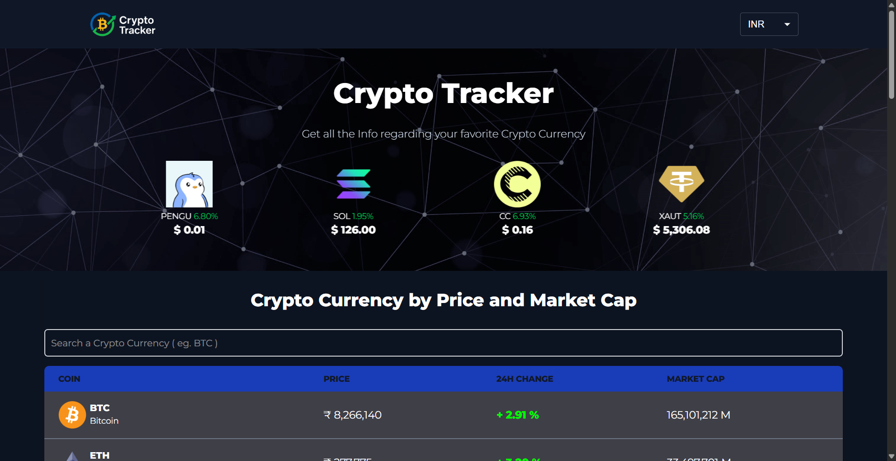
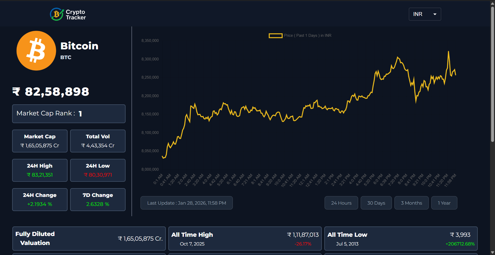

# CryptoTracker — Real‑time Crypto Markets + Charts + News

[](https://crypto-tracker-alpha-bay.vercel.app/)
[](https://github.com/yashrahadve05/Crypto_Tracker)
[](LICENSE)

CryptoTracker is a fast, responsive cryptocurrency dashboard for tracking **top coins**, **market metrics**, **interactive historical charts**, and a **news feed**—built as a production-style React (Vite) SPA.

---

## 🔗 Live Demo

- **App**: [Live Demo](https://crypto-tracker-alpha-bay.vercel.app/)

---

## ✨ Features

### 📈 Market Tracking
- Live prices for top coins (CoinGecko markets endpoint)
- Market cap, 24H change, market cap rank (via CoinGecko data)
- Trending coins carousel (CoinGecko trending endpoint)
- Search by coin name or symbol
- Pagination for large lists

### 📊 Charts & Coin Details
- Coin detail view with key metrics (rank, market cap, volume, highs/lows, supply)
- Interactive price history chart with ranges:
  - 24H / 30D / 90D / 1Y
- “Last updated” timestamp display for chart section

### 🌍 Currency & UX
- Multi-currency selection via global Context (INR / USD / EUR / GBP)
- Responsive layout (Tailwind) with Material UI components
- Loading states and basic error handling for API calls

### 📰 News
- News feed section powered by CoinDesk Data API endpoint
- Pagination for articles

---

## 🧱 Tech Stack

### 🎨 Frontend
- React (Vite)
- React Router
- Tailwind CSS
- Material UI (MUI) + Emotion
- Headless UI + Heroicons
- Swiper (carousel)

### 📊 Data Visualization
- Chart.js + `react-chartjs-2`

### 🌐 Networking
- Axios

### 🧩 Backend
- None (client-side SPA)

### 🔌 APIs
- CoinGecko API (market data + trending + coin info + market chart)
- CoinDesk Data API (news list endpoint)

### 🚀 Tooling & Quality
- ESLint (React Hooks + React Refresh)

### ☁️ Deployment
- Vercel

---

## 🏗️ Architecture Overview

CryptoTracker is a **client-side SPA**:

- **Routing**: `react-router-dom`
  - `/` → `HomePage` (banner + coin table + news)
  - `/coins/:id` → `CoinInfoPage` (coin metrics + chart)
- **Global State**: React Context (`src/context/CryptoContextProvider.jsx`)
  - Stores selected `currency` and derived `symbol`
- **Data Fetching**: Axios calls inside page/components
  - Market list, trending, coin details, and chart series from CoinGecko
  - News list from CoinDesk Data API

---

## 🗂️ Folder Structure
```
CryptoTracker/
├─ public/
│  └─ vite.svg
├─ src/
│  ├─ assets/
│  │  ├─ banner2.jpg
│  │  ├─ Logo_Nav.png
│  │  └─ NavLogoPNG.png
│  ├─ components/
│  │  ├─ Banner.jsx
│  │  ├─ CoinChart.jsx
│  │  ├─ CoinTable.jsx
│  │  ├─ Footer.jsx
│  │  ├─ Header.jsx
│  │  ├─ NavBar.jsx
│  │  └─ NewsContainer.jsx
│  ├─ context/
│  │  └─ CryptoContextProvider.jsx
│  ├─ pages/
│  │  ├─ CoinInfoPage.jsx
│  │  ├─ CoinPage.jsx
│  │  └─ HomePage.jsx
│  ├─ App.jsx
│  ├─ App.css
│  ├─ index.css
│  └─ main.jsx
├─ .env.sample
├─ .gitignore
├─ eslint.config.js
├─ index.html
├─ package-lock.json
├─ package.json
└─ vite.config.js
```

---

## ⚙️ Installation

```bash
git clone https://github.com/yashrahadve05/Crypto_Tracker.git
cd Crypto_Tracker
npm install
```

---

## 🔐 Environment Variables

This project uses Vite, so any env variables exposed to the app must be prefixed with `VITE_`.

Create a `.env` file in the repo root (see `.env.sample`):

macOS / Linux:

```bash
cp .env.sample .env
```

Windows (PowerShell):

```powershell
Copy-Item .env.sample .env
```

Set the required variable:

```bash
# Used by the News feed request in src/pages/CoinPage.jsx
VITE_CRYPTO_NEWS_API=your_api_key_here
```

Notes:
- `.env` is already ignored by Git.
- Restart `npm run dev` after changing env vars.

---

## 🧪 Development Commands

```bash
npm run dev
```

```bash
npm run lint
```

---

## 🏗️ Production Build

```bash
npm run build
```

Preview locally:

```bash
npm run preview
```

---

## ☁️ Deployment (Vercel)

1. Import the GitHub repo in Vercel
2. Add Environment Variables in **Vercel → Project → Settings → Environment Variables**:
   - `VITE_CRYPTO_NEWS_API`
3. Use default Vite settings:
   - **Build Command**: `npm run build`
   - **Output Directory**: `dist`
4. Deploy

---

## 🖼️ Screenshots







```text
TODO (recommended for recruiters):
- Home: Trending carousel + coins table + search
- Coin details: metrics + historical chart
- News: paginated cards
```

---

## 🧭 Future Improvements

- Move news fetching behind a server-side proxy (avoid exposing keys in client bundle)
- Add caching and rate-limit protection for API calls
- Add watchlist (localStorage) + favorites
- Add sorting/filtering (market cap, volume, 24H change)
- Improve error UX (empty states, retries, toast notifications)
- Add tests + CI (lint on PR, basic component/unit tests)

---

## 📚 Learning Outcomes / Engineering Decisions

- **Context-driven currency state** to keep pricing consistent across the app
- **Route-based UI composition**: list + details pages with clear separation
- **Chart.js integration** for time-series visualization with dynamic ranges
- **Responsive UI** with Tailwind while leveraging MUI for complex components (Select, Pagination, loaders)
- **Lint-first workflow** with ESLint React Hooks + Vite React Refresh rules

---

## 🧾 Resume‑ready Project Summary

Built **CryptoTracker**, a React + Vite single-page application that surfaces real-time crypto market data and historical price charts using the CoinGecko API, with a responsive UI, global currency state via Context, and a paginated crypto news feed powered by the CoinDesk Data API. Deployed to Vercel with environment-based configuration.

---

## 👤 Author

**Yash Kumar Rahadve**  

- LinkedIn: [yashrahadve05](https://www.linkedin.com/in/yashrahadve/)
- X: [@yashrahadve05](https://x.com/Yashrahadve05)
- Email: [yashrahadve05@gmail.com](mailto:yashrahadve05@gmail.com)